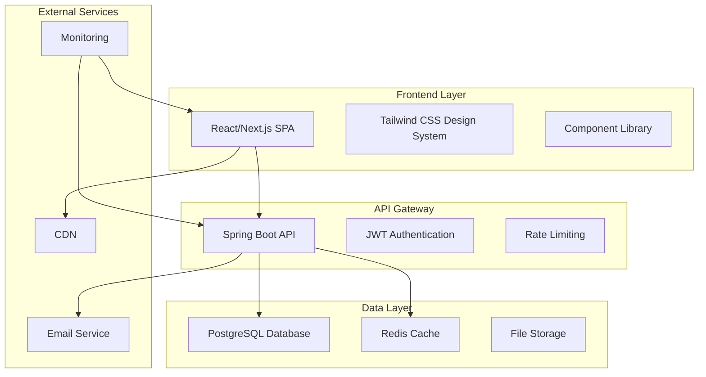
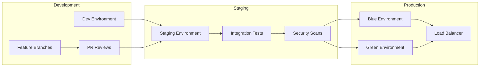

# PAPSNET Homepage - Comprehensive Quality Assurance & Architecture Document

## Executive Summary

This document establishes the comprehensive quality assurance framework, architectural guidelines, and integration protocols for the PAPSNET (주)팹스넷 homepage implementation. Based on the Graphite website component analysis and our specialized agent team structure, this QA strategy ensures technical excellence, security compliance, and seamless user experience delivery.

**Project Overview:**
- **Client**: PAPSNET (주)팹스넷
- **Objective**: Modern, responsive homepage implementation
- **Reference Design**: Graphite.dev component system
- **Team Structure**: Tech Lead + UX/UI Expert + Frontend Specialist + Backend Expert
- **Timeline**: 4-week implementation cycle

**Quality Metrics Targets:**
- Code Coverage: ≥80% (Critical paths)
- Performance: <3s load time, <500ms API response
- Accessibility: WCAG 2.1 AA compliance
- Security: Zero critical vulnerabilities
- Cross-browser: 99%+ compatibility

---

## 1. Architecture Review & Technical Foundation

### 1.1 System Architecture Overview



### 1.2 Component Architecture Alignment

Based on the Graphite website analysis, our component hierarchy follows:

**Layout Components:**
- Header (sticky navigation, logo, CTA buttons)
- Main content sections (hero, features, social proof, CTA)
- Footer (navigation links, company info, status)

**Design System Specifications:**
- **Colors**: Dark theme primary (rgb(0,0,0)), White text (rgb(255,255,255))
- **Typography**: Matter Font primary, fallback system fonts
- **Spacing**: 8px grid system (padding: 0-56px, margin: 0-32px)
- **Borders**: 15px radius for modern feel
- **Animations**: 500ms ease transitions

### 1.3 Technical Stack Validation

**Frontend Stack:**
- Framework: Next.js 14+ (React 18+)
- Styling: Tailwind CSS + CSS Modules
- State Management: Redux Toolkit / Zustand
- HTTP Client: Axios with interceptors
- Build Tool: Vite/Webpack with optimization

**Backend Stack:**
- Framework: Spring Boot 3.2+
- Security: Spring Security 6+ with JWT
- Database: PostgreSQL 15+ with Redis 7+
- Email: Spring Mail with templates
- Documentation: OpenAPI 3.0 + Swagger UI

**Quality Assurance:**
- Testing: Jest, React Testing Library, JUnit 5
- E2E: Playwright for cross-browser testing
- Performance: Lighthouse, Web Vitals monitoring
- Security: OWASP ZAP, dependency scanning

---

## 2. Quality Standards & Acceptance Criteria

### 2.1 Code Quality Standards

**Frontend Quality Gates:**
```yaml
Formatting & Style:
  - ESLint: Airbnb config with React hooks
  - Prettier: 2-space indentation, 80-char line length
  - TypeScript: strict mode enabled
  - Import organization: absolute paths, barrel exports

Component Standards:
  - Atomic design: atoms → molecules → organisms → templates
  - Props validation: TypeScript interfaces
  - Error boundaries: all route-level components
  - Accessibility: semantic HTML, ARIA labels, keyboard navigation

Performance Standards:
  - Bundle size: <500KB initial, <2MB total
  - Core Web Vitals: LCP <2.5s, FID <100ms, CLS <0.1
  - Code splitting: route-based lazy loading
  - Image optimization: WebP format, responsive sizing
```

**Backend Quality Gates:**
```yaml
Code Quality:
  - Checkstyle: Google Java Style Guide
  - SpotBugs: zero high-priority issues
  - PMD: cyclomatic complexity <10
  - JaCoCo: 80%+ test coverage

Architecture Standards:
  - Clean Architecture: controller → service → repository
  - SOLID principles: dependency injection, single responsibility
  - Design patterns: factory, strategy, observer
  - Exception handling: global handler with error codes

Security Standards:
  - JWT tokens: 15min access, 7-day refresh
  - Rate limiting: 100 req/min per IP
  - Input validation: Bean Validation (JSR-380)
  - SQL injection: parameterized queries only
```

### 2.2 Performance Benchmarks

**Frontend Performance Targets:**
- **Load Time**: <3s on 3G, <1s on WiFi
- **Bundle Analysis**: Main bundle <500KB, vendor <1MB
- **Runtime Performance**: 60fps animations, <16ms render time
- **Memory Usage**: <50MB heap for mobile, <100MB desktop

**Backend Performance Targets:**
- **API Response**: <200ms average, <500ms 95th percentile
- **Database**: <100ms query execution, 80%+ index usage
- **Concurrent Users**: 1000+ simultaneous connections
- **Throughput**: >1000 requests per second

**Infrastructure Performance:**
- **CDN**: <100ms global edge response
- **Database Connection**: <50ms establishment time
- **Cache Hit Rate**: >90% for static content
- **Error Rate**: <0.1% for critical operations

### 2.3 Security Compliance Matrix

| Security Domain | Standard | Implementation | Validation Method |
|-----------------|----------|----------------|-------------------|
| Authentication | JWT + Refresh Token | Spring Security 6 | Automated security tests |
| Authorization | Role-based access | Method-level security | Integration tests |
| Data Protection | AES-256 encryption | JPA field encryption | Security audit |
| Input Validation | Bean Validation | Custom validators | Penetration testing |
| Output Encoding | XSS prevention | Template engines | OWASP ZAP scanning |
| HTTPS | TLS 1.3 minimum | Nginx/Load balancer | SSL Labs testing |
| Rate Limiting | Redis-based | Custom filter | Load testing |
| CORS | Whitelist domains | Spring configuration | Browser testing |

---

## 3. Integration Coordination Framework

### 3.1 API Contract Management

**API-First Development Process:**
1. **OpenAPI Specification**: Define before implementation
2. **Mock Server**: Swagger UI for frontend development
3. **Contract Testing**: Automated validation
4. **Version Management**: Semantic versioning with backward compatibility

**Core API Endpoints:**
```yaml
Contact Management:
  POST   /api/v1/contacts              # Submit contact form
  GET    /api/v1/contacts              # List contacts (admin)
  PUT    /api/v1/contacts/{id}/status  # Update status (admin)

Newsletter:
  POST   /api/v1/newsletters/subscribe   # Subscribe to newsletter
  POST   /api/v1/newsletters/unsubscribe # Unsubscribe
  GET    /api/v1/newsletters             # List subscribers (admin)

Content Management:
  GET    /api/v1/contents               # Fetch published content
  GET    /api/v1/contents/{type}        # Get content by type
  POST   /api/v1/contents               # Create content (admin)
  PUT    /api/v1/contents/{id}          # Update content (admin)

Health & Monitoring:
  GET    /api/health                    # Health check
  GET    /api/metrics                   # Application metrics
```

**Response Standardization:**
```json
{
  "success": true,
  "data": { "...": "payload" },
  "message": "Operation successful",
  "timestamp": "2025-01-21T10:00:00Z"
}

{
  "success": false,
  "error": {
    "code": "VALIDATION_ERROR",
    "message": "Invalid input data",
    "details": ["Email format is invalid"]
  },
  "timestamp": "2025-01-21T10:00:00Z"
}
```

### 3.2 Data Model Coordination

**Shared Data Models:**
```typescript
// Contact Form Data
interface ContactRequest {
  name: string;
  email: string;
  company?: string;
  phone?: string;
  subject: string;
  message: string;
}

// Newsletter Subscription
interface NewsletterRequest {
  email: string;
  name?: string;
}

// Content Management
interface ContentResponse {
  id: number;
  type: 'HERO' | 'FEATURE' | 'TESTIMONIAL' | 'BLOG';
  title: string;
  content: string;
  imageUrl?: string;
  displayOrder: number;
  isPublished: boolean;
  createdAt: string;
  updatedAt: string;
}
```

**Database Schema Coordination:**
- **Naming Convention**: snake_case for database, camelCase for API
- **Field Validation**: Shared between frontend and backend
- **Audit Fields**: created_at, updated_at, created_by, updated_by
- **Soft Delete**: is_deleted flag instead of hard deletion

### 3.3 Cross-Domain Communication Protocols

**Development Communication:**
- **Daily Standups**: 15min sync on progress and blockers
- **API Reviews**: Weekly 30min session for contract validation
- **Integration Testing**: Bi-weekly end-to-end testing sessions
- **Code Reviews**: All cross-domain PRs require peer review

**Documentation Standards:**
- **API Documentation**: OpenAPI 3.0 with examples
- **Component Documentation**: Storybook for UI components
- **Architecture Documentation**: C4 model diagrams
- **Deployment Documentation**: Step-by-step runbooks

---

## 4. Comprehensive Test Strategy

### 4.1 Testing Pyramid

```mermaid
pyramid
    title Testing Pyramid
    top "E2E Tests (10%)"
    middle "Integration Tests (20%)"
    bottom "Unit Tests (70%)"
```

### 4.2 Frontend Testing Strategy

**Unit Testing (70% of test effort):**
```javascript
// Component Testing Example
describe('ContactForm', () => {
  it('should validate email format', () => {
    render(<ContactForm />);
    const emailInput = screen.getByLabelText(/email/i);
    fireEvent.change(emailInput, { target: { value: 'invalid-email' } });
    fireEvent.blur(emailInput);
    expect(screen.getByText('Please enter a valid email')).toBeInTheDocument();
  });

  it('should submit form with valid data', async () => {
    const mockSubmit = jest.fn();
    render(<ContactForm onSubmit={mockSubmit} />);

    // Fill form with valid data
    fireEvent.change(screen.getByLabelText(/name/i), { target: { value: 'John Doe' } });
    fireEvent.change(screen.getByLabelText(/email/i), { target: { value: 'john@example.com' } });

    fireEvent.click(screen.getByRole('button', { name: /submit/i }));

    await waitFor(() => {
      expect(mockSubmit).toHaveBeenCalledWith({
        name: 'John Doe',
        email: 'john@example.com'
      });
    });
  });
});
```

**Integration Testing (20% of test effort):**
- API Integration: Mock service worker for HTTP mocking
- State Management: Redux store testing
- Route Testing: React Router navigation
- Form Validation: Cross-component validation flows

**E2E Testing (10% of test effort):**
```javascript
// Playwright E2E Test Example
test('contact form submission flow', async ({ page }) => {
  await page.goto('/contact');

  // Fill contact form
  await page.fill('[data-testid="name-input"]', 'Jane Smith');
  await page.fill('[data-testid="email-input"]', 'jane@company.com');
  await page.fill('[data-testid="subject-input"]', 'Partnership Inquiry');
  await page.fill('[data-testid="message-input"]', 'Interested in collaboration');

  // Submit and verify
  await page.click('[data-testid="submit-button"]');
  await expect(page.locator('[data-testid="success-message"]')).toBeVisible();

  // Verify API call was made
  const requests = page.context().waitForRequest('/api/v1/contacts');
  expect(requests).toBeTruthy();
});
```

### 4.3 Backend Testing Strategy

**Unit Testing (70% of test effort):**
```java
@ExtendWith(MockitoExtension.class)
class ContactServiceTest {

    @Mock
    private ContactRepository contactRepository;

    @Mock
    private EmailService emailService;

    @InjectMocks
    private ContactService contactService;

    @Test
    void shouldCreateContactSuccessfully() {
        // Given
        ContactRequest request = new ContactRequest(
            "John Doe", "john@example.com", "Test Subject", "Test Message"
        );
        Contact savedContact = new Contact(1L, "John Doe", "john@example.com", "Test Subject", "Test Message");

        when(contactRepository.save(any(Contact.class))).thenReturn(savedContact);

        // When
        ContactResponse response = contactService.createContact(request);

        // Then
        assertThat(response.getId()).isEqualTo(1L);
        assertThat(response.getName()).isEqualTo("John Doe");
        verify(emailService).sendNotificationEmail(any(Contact.class));
    }

    @Test
    void shouldThrowExceptionForInvalidEmail() {
        // Given
        ContactRequest request = new ContactRequest(
            "John Doe", "invalid-email", "Test Subject", "Test Message"
        );

        // When & Then
        assertThatThrownBy(() -> contactService.createContact(request))
            .isInstanceOf(ValidationException.class)
            .hasMessage("Invalid email format");
    }
}
```

**Integration Testing (20% of test effort):**
```java
@SpringBootTest(webEnvironment = SpringBootTest.WebEnvironment.RANDOM_PORT)
@TestPropertySource(locations = "classpath:application-test.properties")
@Testcontainers
class ContactControllerIntegrationTest {

    @Container
    static PostgreSQLContainer<?> postgres = new PostgreSQLContainer<>("postgres:15")
            .withDatabaseName("testdb")
            .withUsername("test")
            .withPassword("test");

    @Autowired
    private TestRestTemplate restTemplate;

    @Test
    void shouldCreateContactAndReturnCreated() {
        // Given
        ContactRequest request = new ContactRequest(
            "Integration Test", "test@example.com", "Test Subject", "Test Message"
        );

        // When
        ResponseEntity<ApiResponse<ContactResponse>> response = restTemplate.postForEntity(
            "/api/v1/contacts", request,
            new ParameterizedTypeReference<ApiResponse<ContactResponse>>() {}
        );

        // Then
        assertThat(response.getStatusCode()).isEqualTo(HttpStatus.CREATED);
        assertThat(response.getBody().isSuccess()).isTrue();
        assertThat(response.getBody().getData().getName()).isEqualTo("Integration Test");
    }
}
```

**Performance Testing:**
```java
@Test
void shouldHandleConcurrentContactSubmissions() throws InterruptedException {
    int threadCount = 100;
    CountDownLatch latch = new CountDownLatch(threadCount);
    ExecutorService executor = Executors.newFixedThreadPool(threadCount);

    for (int i = 0; i < threadCount; i++) {
        final int index = i;
        executor.submit(() -> {
            try {
                ContactRequest request = new ContactRequest(
                    "User" + index, "user" + index + "@example.com",
                    "Subject", "Message"
                );
                ResponseEntity<ApiResponse<ContactResponse>> response =
                    restTemplate.postForEntity("/api/v1/contacts", request,
                        new ParameterizedTypeReference<ApiResponse<ContactResponse>>() {});

                assertThat(response.getStatusCode()).isEqualTo(HttpStatus.CREATED);
            } finally {
                latch.countDown();
            }
        });
    }

    boolean completed = latch.await(30, TimeUnit.SECONDS);
    assertThat(completed).isTrue();
}
```

### 4.4 Cross-Browser & Device Testing Matrix

| Browser | Desktop | Tablet | Mobile | Automated | Manual |
|---------|---------|--------|--------|-----------|--------|
| Chrome 120+ | ✅ | ✅ | ✅ | Playwright | Spot check |
| Firefox 120+ | ✅ | ✅ | ✅ | Playwright | Spot check |
| Safari 17+ | ✅ | ✅ | ✅ | Playwright | Full test |
| Edge 120+ | ✅ | ✅ | ✅ | Playwright | Spot check |
| iOS Safari | N/A | ✅ | ✅ | BrowserStack | Full test |
| Android Chrome | N/A | ✅ | ✅ | BrowserStack | Full test |

**Device Testing Matrix:**
- **Desktop**: 1920x1080, 1366x768, 2560x1440
- **Tablet**: iPad (1024x768), Surface (1280x800)
- **Mobile**: iPhone 13 (390x844), Galaxy S21 (360x800)

---

## 5. Risk Assessment & Mitigation Strategies

### 5.1 Technical Risk Matrix

| Risk Category | Risk | Probability | Impact | Severity | Mitigation Strategy |
|---------------|------|-------------|--------|----------|-------------------|
| **Performance** | Slow API response times | Medium | High | 🔴 High | Database indexing, Redis caching, query optimization |
| **Security** | XSS vulnerabilities | Low | Critical | 🔴 High | Input sanitization, CSP headers, security scanning |
| **Integration** | Frontend-Backend API mismatch | Medium | Medium | 🟡 Medium | Contract-first development, automated testing |
| **Browser** | Cross-browser compatibility issues | Medium | Medium | 🟡 Medium | Progressive enhancement, polyfills, extensive testing |
| **Scale** | High traffic load issues | Low | High | 🟡 Medium | Load testing, horizontal scaling, CDN implementation |
| **Data** | Database connection failures | Low | High | 🟡 Medium | Connection pooling, retry logic, failover setup |
| **Deployment** | Production deployment failures | Medium | High | 🔴 High | Blue-green deployment, rollback procedures, staging env |
| **User Experience** | Poor mobile performance | Medium | Medium | 🟡 Medium | Mobile-first design, performance budgets, testing |

### 5.2 Detailed Risk Mitigation Plans

**High-Priority Risk Mitigation:**

**Risk: Slow API Response Times**
- **Prevention**:
  - Database query optimization during development
  - Redis caching for frequently accessed data
  - Connection pooling with HikariCP
  - API response compression
- **Detection**:
  - Application performance monitoring (APM)
  - Response time alerts (<500ms threshold)
  - Database slow query logging
- **Response**:
  - Immediate query analysis and optimization
  - Cache warm-up procedures
  - Horizontal scaling activation
  - CDN cache invalidation if needed

**Risk: XSS Vulnerabilities**
- **Prevention**:
  - Input sanitization on all form fields
  - Content Security Policy (CSP) headers
  - Output encoding in templates
  - Regular security dependency updates
- **Detection**:
  - Automated OWASP ZAP scanning in CI/CD
  - Manual penetration testing
  - Security code reviews
- **Response**:
  - Immediate patch deployment
  - Security advisory notifications
  - Comprehensive security audit
  - User notification if data affected

**Risk: Production Deployment Failures**
- **Prevention**:
  - Comprehensive staging environment testing
  - Blue-green deployment strategy
  - Automated rollback procedures
  - Infrastructure as code
- **Detection**:
  - Health check monitoring
  - Error rate spike alerts
  - User experience monitoring
- **Response**:
  - Immediate rollback activation
  - Incident response team activation
  - Root cause analysis
  - Post-mortem documentation

### 5.3 Quality Gates & Go/No-Go Criteria

**Pre-Deployment Quality Gates:**

**Gate 1: Development Complete**
- ✅ All features implemented per specification
- ✅ Unit test coverage ≥80%
- ✅ No critical or high-severity bugs
- ✅ Code review approval from Tech Lead
- ✅ Performance benchmarks met in dev environment

**Gate 2: Integration Testing**
- ✅ All API contracts validated
- ✅ End-to-end user flows functional
- ✅ Cross-browser compatibility verified
- ✅ Security scan passed (zero critical vulnerabilities)
- ✅ Load testing completed successfully

**Gate 3: Staging Validation**
- ✅ Production-like environment testing passed
- ✅ Performance targets met under load
- ✅ Database migration scripts validated
- ✅ Monitoring and alerting functional
- ✅ Rollback procedures tested

**Gate 4: Production Readiness**
- ✅ Security final approval
- ✅ Performance final validation
- ✅ Business stakeholder sign-off
- ✅ Support team training completed
- ✅ Incident response procedures in place

---

## 6. Deployment & Monitoring Guidelines

### 6.1 Deployment Architecture



### 6.2 CI/CD Pipeline Configuration

**Frontend Pipeline:**
```yaml
# .github/workflows/frontend.yml
name: Frontend CI/CD
on:
  push:
    branches: [main, develop]
  pull_request:
    branches: [main]

jobs:
  test:
    runs-on: ubuntu-latest
    steps:
      - uses: actions/checkout@v3
      - uses: actions/setup-node@v3
        with:
          node-version: '18'
          cache: 'npm'

      - run: npm ci
      - run: npm run lint
      - run: npm run type-check
      - run: npm run test:coverage
      - run: npm run build

      - name: Upload coverage
        uses: codecov/codecov-action@v3

      - name: Lighthouse CI
        run: npm run lighthouse:ci

      - name: Security audit
        run: npm audit --audit-level high

  e2e-tests:
    runs-on: ubuntu-latest
    needs: test
    steps:
      - uses: actions/checkout@v3
      - uses: actions/setup-node@v3
      - run: npm ci
      - run: npm run build
      - run: npm run test:e2e

  deploy-staging:
    if: github.ref == 'refs/heads/develop'
    needs: [test, e2e-tests]
    runs-on: ubuntu-latest
    steps:
      - name: Deploy to Staging
        run: |
          # Deploy to staging environment
          # Run smoke tests
          # Notify team
```

**Backend Pipeline:**
```yaml
# .github/workflows/backend.yml
name: Backend CI/CD
on:
  push:
    branches: [main, develop]
  pull_request:
    branches: [main]

jobs:
  test:
    runs-on: ubuntu-latest
    services:
      postgres:
        image: postgres:15
        env:
          POSTGRES_PASSWORD: postgres
        options: >-
          --health-cmd pg_isready
          --health-interval 10s
          --health-timeout 5s
          --health-retries 5
      redis:
        image: redis:7
        options: >-
          --health-cmd "redis-cli ping"
          --health-interval 10s
          --health-timeout 5s
          --health-retries 5

    steps:
      - uses: actions/checkout@v3
      - uses: actions/setup-java@v3
        with:
          java-version: '17'
          distribution: 'temurin'

      - name: Cache Maven packages
        uses: actions/cache@v3
        with:
          path: ~/.m2
          key: ${{ runner.os }}-m2-${{ hashFiles('**/pom.xml') }}

      - run: mvn clean compile
      - run: mvn spotbugs:check
      - run: mvn pmd:check
      - run: mvn test
      - run: mvn verify

      - name: Generate coverage report
        run: mvn jacoco:report

      - name: Security scan
        run: mvn org.owasp:dependency-check-maven:check

      - name: Integration tests
        run: mvn test -Dtest=**/*IntegrationTest

  security-scan:
    runs-on: ubuntu-latest
    needs: test
    steps:
      - uses: actions/checkout@v3
      - name: Run OWASP ZAP scan
        run: |
          docker run -v $(pwd):/zap/wrk/:rw -t owasp/zap2docker-stable zap-baseline.py \
            -t http://localhost:8080 -J zap-report.json
```

### 6.3 Environment Configuration

**Development Environment:**
```yaml
# application-dev.yml
server:
  port: 8080

spring:
  datasource:
    url: jdbc:postgresql://localhost:5432/papsnet_dev
    username: dev_user
    password: dev_password

  redis:
    host: localhost
    port: 6379

  mail:
    host: smtp.mailtrap.io
    port: 2525

logging:
  level:
    com.papsnet: DEBUG

management:
  endpoints:
    web:
      exposure:
        include: health,info,metrics,prometheus
```

**Production Environment:**
```yaml
# application-prod.yml
server:
  port: 8080

spring:
  datasource:
    url: ${DATABASE_URL}
    username: ${DATABASE_USERNAME}
    password: ${DATABASE_PASSWORD}
    hikari:
      maximum-pool-size: 20
      minimum-idle: 5

  redis:
    host: ${REDIS_HOST}
    port: ${REDIS_PORT}
    password: ${REDIS_PASSWORD}

  mail:
    host: ${MAIL_HOST}
    port: ${MAIL_PORT}
    username: ${MAIL_USERNAME}
    password: ${MAIL_PASSWORD}

logging:
  level:
    com.papsnet: INFO

management:
  endpoints:
    web:
      exposure:
        include: health,info,metrics
```

### 6.4 Monitoring & Alerting Strategy

**Application Monitoring:**
```javascript
// Frontend monitoring with Web Vitals
import { getCLS, getFID, getFCP, getLCP, getTTFB } from 'web-vitals';

function sendToAnalytics(metric) {
  // Send to monitoring service
  fetch('/api/analytics', {
    method: 'POST',
    body: JSON.stringify(metric)
  });
}

getCLS(sendToAnalytics);
getFID(sendToAnalytics);
getFCP(sendToAnalytics);
getLCP(sendToAnalytics);
getTTFB(sendToAnalytics);

// Error boundary monitoring
class ErrorBoundary extends React.Component {
  componentDidCatch(error, errorInfo) {
    // Log to monitoring service
    console.error('ErrorBoundary caught an error', error, errorInfo);

    // Send to error tracking service
    fetch('/api/errors', {
      method: 'POST',
      body: JSON.stringify({
        error: error.toString(),
        stack: error.stack,
        componentStack: errorInfo.componentStack,
        timestamp: new Date().toISOString()
      })
    });
  }
}
```

**Backend Monitoring Configuration:**
```java
@Component
public class ApplicationMetrics {

    private final MeterRegistry meterRegistry;
    private final Counter apiCallCounter;
    private final Timer responseTimeTimer;

    public ApplicationMetrics(MeterRegistry meterRegistry) {
        this.meterRegistry = meterRegistry;
        this.apiCallCounter = Counter.builder("api.calls.total")
            .description("Total API calls")
            .register(meterRegistry);
        this.responseTimeTimer = Timer.builder("api.response.time")
            .description("API response time")
            .register(meterRegistry);
    }

    public void recordApiCall(String endpoint, String method, int status) {
        apiCallCounter.increment(
            Tags.of(
                "endpoint", endpoint,
                "method", method,
                "status", String.valueOf(status)
            )
        );
    }

    public Timer.Sample startTimer() {
        return Timer.start(meterRegistry);
    }
}
```

**Alert Configuration:**
```yaml
# Prometheus alerting rules
groups:
  - name: application.rules
    rules:
      - alert: HighErrorRate
        expr: rate(api_calls_total{status=~"4..|5.."}[5m]) > 0.1
        for: 2m
        labels:
          severity: critical
        annotations:
          summary: "High error rate detected"
          description: "Error rate is {{ $value }}% for the last 5 minutes"

      - alert: SlowResponseTime
        expr: histogram_quantile(0.95, rate(api_response_time_bucket[5m])) > 0.5
        for: 3m
        labels:
          severity: warning
        annotations:
          summary: "Slow API response time"
          description: "95th percentile response time is {{ $value }}s"

      - alert: DatabaseConnectionIssue
        expr: spring_datasource_active_connections / spring_datasource_max_connections > 0.8
        for: 1m
        labels:
          severity: warning
        annotations:
          summary: "Database connection pool nearly exhausted"
```

### 6.5 Rollback & Recovery Procedures

**Automated Rollback Triggers:**
```yaml
# Rollback criteria
rollback_triggers:
  error_rate: >5%  # If error rate exceeds 5%
  response_time: >2s  # If 95th percentile exceeds 2 seconds
  availability: <99%  # If availability drops below 99%
  manual_trigger: true  # Manual rollback capability

# Rollback process
rollback_steps:
  1. Stop traffic to new deployment
  2. Redirect traffic to previous version
  3. Verify system stability
  4. Notify incident response team
  5. Begin root cause analysis
```

**Manual Recovery Procedures:**
```bash
#!/bin/bash
# Emergency rollback script

echo "Starting emergency rollback..."

# Stop current deployment
kubectl set image deployment/papsnet-frontend frontend=papsnet/frontend:previous --record
kubectl set image deployment/papsnet-backend backend=papsnet/backend:previous --record

# Wait for rollout
kubectl rollout status deployment/papsnet-frontend
kubectl rollout status deployment/papsnet-backend

# Verify health
curl -f http://localhost/api/health || exit 1

# Clear cache
redis-cli FLUSHDB

echo "Rollback completed successfully"

# Send notifications
curl -X POST "$SLACK_WEBHOOK" -d '{"text":"Emergency rollback completed for PAPSNET homepage"}'
```

---

## 7. Approval Framework & Sign-off Process

### 7.1 Review Checkpoints

**Weekly Review Schedule:**
- **Monday**: Architecture & Design Review (UX/UI + Tech Lead)
- **Wednesday**: Implementation Progress Review (Frontend + Backend + Tech Lead)
- **Friday**: Integration & Quality Review (All agents + stakeholders)

**Milestone Checkpoints:**
- **Week 1**: Foundation & Setup Approval
- **Week 2**: Core Implementation Approval
- **Week 3**: Integration & Security Approval
- **Week 4**: Production Readiness Approval

### 7.2 Sign-off Matrix

| Component | UX/UI Expert | Frontend Specialist | Backend Expert | Tech Lead | Stakeholder |
|-----------|--------------|-------------------|---------------|-----------|-------------|
| Design System | ✅ Primary | 🔍 Review | ➖ N/A | ✅ Approve | 🔍 Review |
| Frontend Implementation | 🔍 Review | ✅ Primary | ➖ N/A | ✅ Approve | 🔍 Review |
| API Design & Implementation | ➖ N/A | 🔍 Review | ✅ Primary | ✅ Approve | ➖ N/A |
| Integration | 🔍 Review | 🔍 Review | 🔍 Review | ✅ Primary | ➖ N/A |
| Security Implementation | ➖ N/A | 🔍 Review | ✅ Primary | ✅ Approve | ➖ N/A |
| Performance Optimization | 🔍 Review | 🔍 Review | 🔍 Review | ✅ Primary | ➖ N/A |
| Production Deployment | ➖ N/A | ➖ N/A | ➖ N/A | ✅ Primary | ✅ Approve |

**Legend:**
- ✅ Primary responsibility and sign-off required
- 🔍 Review and feedback required
- ➖ Not applicable/optional

### 7.3 Final Deployment Approval

**Pre-Production Checklist:**
```markdown
## Technical Validation
- [ ] All unit tests passing (≥80% coverage)
- [ ] All integration tests passing
- [ ] Security scan completed (zero critical vulnerabilities)
- [ ] Performance benchmarks met
- [ ] Cross-browser testing completed
- [ ] Accessibility compliance verified (WCAG 2.1 AA)

## Infrastructure Readiness
- [ ] Production environment provisioned
- [ ] Database migration scripts tested
- [ ] CDN configuration verified
- [ ] SSL certificates installed
- [ ] Monitoring and alerting configured
- [ ] Backup and recovery procedures tested

## Business Validation
- [ ] User acceptance testing completed
- [ ] Content management system functional
- [ ] Contact form workflow verified
- [ ] Newsletter subscription tested
- [ ] SEO optimization implemented
- [ ] Analytics tracking configured

## Compliance & Documentation
- [ ] Security compliance verified
- [ ] Privacy policy implementation
- [ ] GDPR compliance (if applicable)
- [ ] Accessibility statement
- [ ] API documentation updated
- [ ] User documentation completed

## Go-Live Readiness
- [ ] Support team trained
- [ ] Incident response procedures documented
- [ ] Rollback procedures tested
- [ ] Communication plan activated
- [ ] Stakeholder sign-offs obtained
```

**Final Sign-off Authority:**
1. **Tech Lead**: Technical implementation and architecture
2. **Stakeholder**: Business requirements and user experience
3. **Operations Team**: Infrastructure and deployment readiness
4. **Security Team**: Security compliance and risk assessment

---

## Conclusion

This comprehensive QA and architecture document establishes the framework for delivering a high-quality, secure, and performant PAPSNET homepage. The multi-agent coordination approach ensures expertise-driven development while maintaining architectural consistency and quality standards throughout the implementation lifecycle.

**Success Criteria:**
- ✅ Zero critical security vulnerabilities
- ✅ Sub-3-second page load times
- ✅ WCAG 2.1 AA accessibility compliance
- ✅ 99%+ cross-browser compatibility
- ✅ 80%+ test coverage across all layers
- ✅ Successful deployment with zero downtime

**Next Steps:**
1. Review and approve this QA framework with all agents
2. Begin Week 1 implementation following the established guidelines
3. Execute weekly review checkpoints as scheduled
4. Maintain continuous communication and quality monitoring
5. Prepare for production deployment with full validation

This document serves as the single source of truth for quality standards and will be updated as the project evolves to reflect any changes in requirements or technical approach.